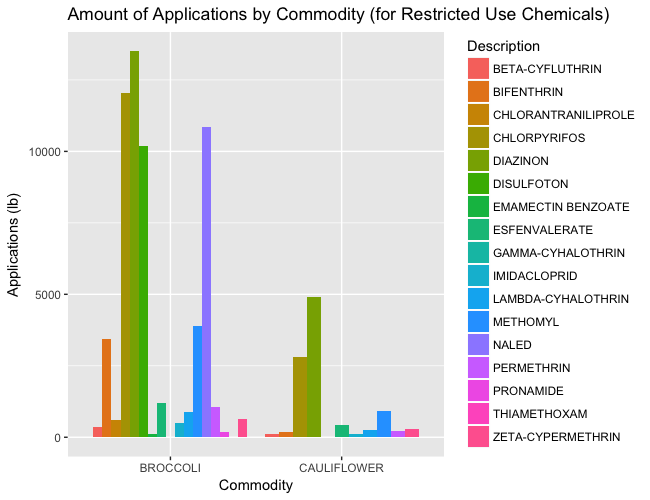
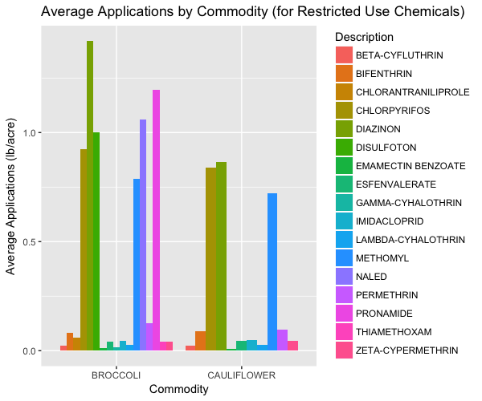
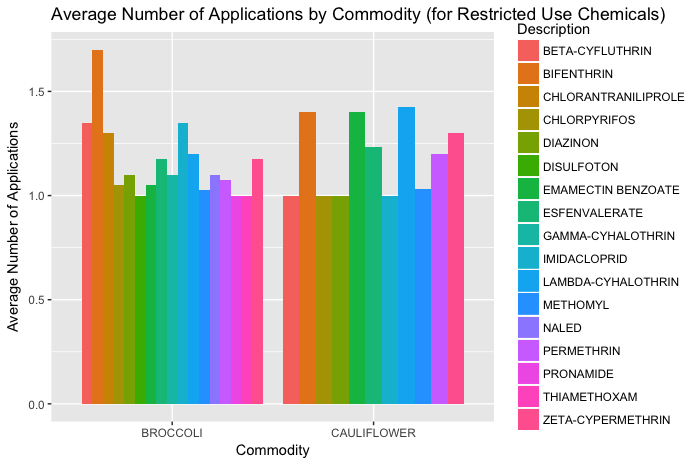
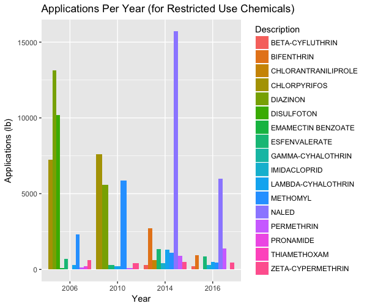
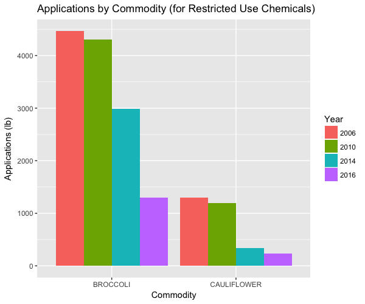
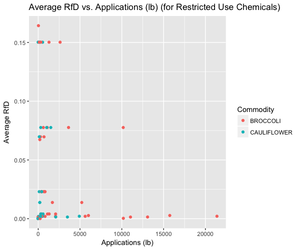
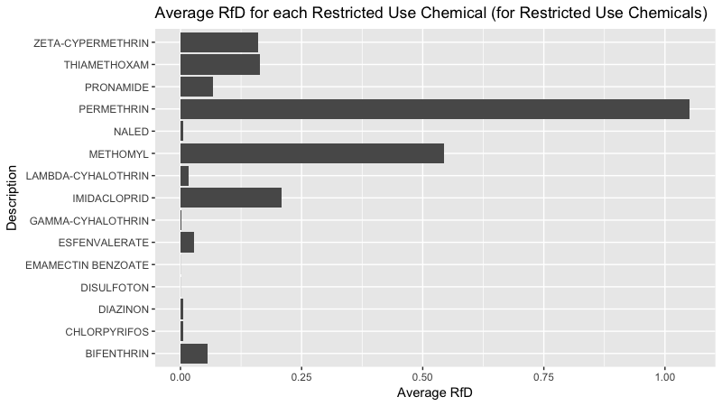
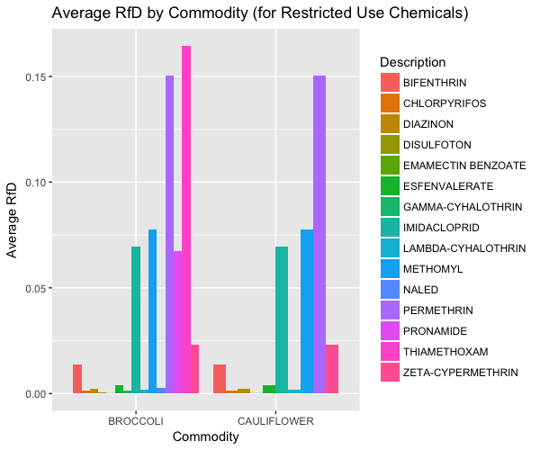
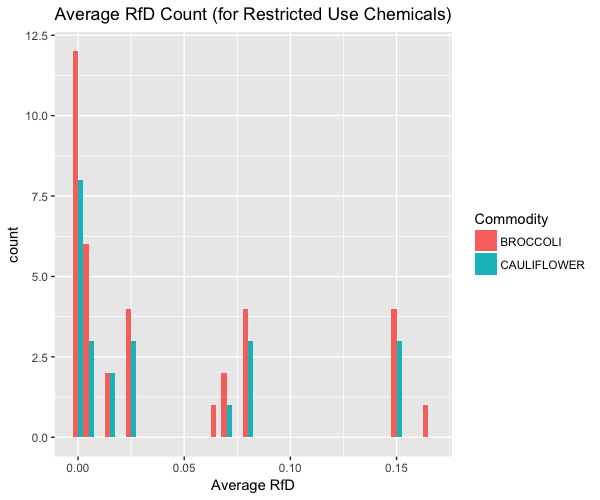

```{r setup, include=FALSE}
knitr::opts_chunk$set(echo = FALSE)
```

## Data Cleaning Process
- The data was collected to gain insight about chemical treatments applied to food crops as fertilizer, insecticides, etc. 
- The goal was to make the vegetable dataset tidy so that we could more easily work with it. In order to make it tidy, we needed to make it so each variable has its own column, each observation has its own row, and each value has its own cell. 
- First, we removed the columns that only have NA values then separated the columns one at a time. 
- We separted DOMAIN, SUBDOMAIN and (Description) and renamed the column with (Description) to "Description".

## Continuing to Clean
- We ran into a problem with our data set as it was too large, so we had to do the spread() command by hand, as seen in our code. 
- In class, we noted that some of the chemicals used on our food are classified as 'Restricted Use Chemicals'. We isolated these chemicals in the veg1 dataset and found technical information about their toxicity in ECOTOX, the Beta version of ECOTOX, and the EPA Chenical Dashboard.
- Please note: RfD is an estimate (with uncertainty spanning perhaps an order of magnitude) of a daily exposure to the human population (including sensitive subgroups) that is likely to be without an appreciable risk of deleterious effects during a lifetime.

## Amount of Applications by Commodity


## Avergae Application by Commodity


## Average Number of Applications by Commodity


## Applications Per Year


## Applications by Commodity


## Average RfD vs. Applications


## Average RfD for each Restricted Use Chemical


## Average Rfd by Commodity


## Average RfD Count


