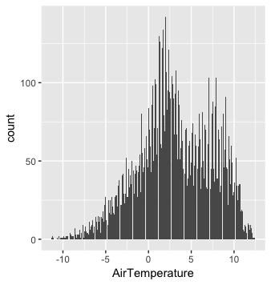

```{r setup, include=FALSE}
knitr::opts_chunk$set(echo = FALSE)
```

## Data Collected 

- We retrieved data from NOAA Weather Station buoy 46035 at 57.026 N 177.738 W in the NOAA National Data Buoy Center.
- After all of the data was collected, we checked for outliers using histograms. We found that there are temperatures recorded at 999 and it seems that they are used for NA values. 
- Because all temperature values over 60 are recoreded as 999, we made all values over 60 NA. We repeated a similar process for all of the variables.  

## Distribution of Air and Water Temperature at Noon from 1985 to 2017




## General Trend of Air and Water Temperature Over the Year


## Time Series of Air Temperature and Water Temperature


## Relationship between Air Temperature and Water Temperature


## Has the mean changed over the last 30 years?


## Has the mean changed over the last 30 years?

- We conducted a t test to determine if the change of Air Temperature over the past 30 years is significant. The p-value is .00000005352, which means the change in air temperature means is statistically significant. 
- We conducted the same test on Water Temperature and found a p-value of .0000000005254, which means the change in water temperature means is also statistically significant. 

## Has using one sample a day affected our evaluation?

To determine this, we decided to conduct a one sample t-test to compare the mean of a sample to a population with a known mean. Here, the null hypothesis is that there is no significant difference between the mean in the population from which your sample was drawn and the mean of the known population.

- First, we compared our sample mean of water temperature to the mean of year 2017. The p-value is .8808, which is not statistically significant so we can conclude that the sample is a good representation of the overall data. 
- We did the same test for year 2000 and received a p-value of .6539. Again, that is not statistically significant and we can conclude that the sample is a good representation of the overall data. 

## Has using one sample a day affected our evaluation?

We did the same tests for air temperature. 

- First, we compared our sample mean of air temperature to the mean of year 2017. The p-value is .6633, which is not statistically significant so we can conclude that the sample is a good representation of the overall data. 

- We did the same test for year 2000 and received a p-value of .2072, which is again not statistically significant and we can conclude that the sample is a good representation of the overall data. 

